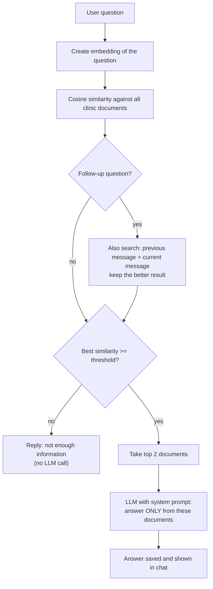

# 🩺 Clinic AI — RAG Chatbot for Clinics

A Persian (RTL) chatbot that answers patients' questions **using only the clinic's own information** — visiting rules, appointment cancellation, blood-test fasting, MRI preparation and more.

Instead of letting an LLM guess, every question is matched against the clinic's knowledge base with **embeddings + cosine similarity** (Retrieval-Augmented Generation). The model only sees the most relevant documents, and if nothing relevant is found the bot honestly says it doesn't have enough information.

> ⚠️ **Disclaimer:** This is a personal learning project. The bot provides general clinic information only and is **not** a substitute for medical advice.

---

## ✨ Features

- **Grounded answers (RAG)** — replies are built from retrieved clinic documents, not from the model's imagination
- **Similarity threshold** — if no document is relevant enough, the bot answers "not enough information" without calling the LLM
- **Follow-up question handling** — short questions like *"how many hours?"* are also searched together with the previous user message, and the better match wins
- **OTP login with phone number** — SMS code stored in Redis with a 2-minute expiry
- **JWT authentication** — access & refresh tokens in signed, `httpOnly` cookies
- **Multiple conversations per user** — create, rename, delete, with persisted history
- **Conversation memory** — recent messages are sent to the model for context
- **Persian RTL chat UI** — server-rendered with EJS, responsive sidebar, typing indicator
- **Free-tier friendly** — uses OpenRouter models for both chat and embeddings

---

## 🧠 How it works



1. Clinic knowledge is split into small, single-topic documents (title + content). Each one is embedded once and stored in MySQL.
2. For each user message, the app embeds the question and compares it with every stored document using cosine similarity.
3. If the best score is below the threshold, the bot refuses politely. Otherwise the top documents are injected into the system prompt.
4. The LLM is instructed to answer in Persian, briefly, and only from the provided text.

---

## 🛠 Tech stack

| Layer | Technology |
|---|---|
| Runtime / server | Node.js, Express 5 |
| Database | MySQL with Sequelize ORM & migrations |
| Cache / OTP store | Redis (ioredis) |
| Auth | JWT, Passport (cookie strategy), OTP via SMS |
| AI | OpenRouter API (chat completions + embeddings) |
| Validation | Yup |
| Frontend | EJS templates, vanilla JavaScript, custom CSS (RTL) |

---

## 📁 Project structure

```
.
├── app.js                  # Express app, routes, views
├── server.js               # Starts the server, checks DB & Redis
├── relation.js             # Sequelize models & associations
├── config.app.js           # Reads all settings from .env
├── seed.js                 # Embeds & stores the clinic documents
└── src
    ├── config/             # Sequelize connection & CLI config
    ├── migrations/         # users, conversations, messages, clinic_documents
    ├── clinic.txt          # The clinic's knowledge base (one "## Title" block per document)
    ├── models/
    ├── module/
    │   ├── auth/           # OTP login, logout, current user
    │   ├── conversations/  # CRUD for conversations
    │   └── messages/       # Chat endpoint (RAG pipeline lives here)
    ├── service/
    │   ├── ai.services.js          # Chat completion call + system prompt
    │   ├── embedding.services.js   # Embedding call
    │   └── sendOtpCode.js          # SMS provider call
    ├── utils/
    │   ├── searchVecto.js          # Embed query + rank documents
    │   ├── compareEmnedding.js     # Cosine similarity
    │   ├── saveChunk.js            # Add a document to the knowledge base
    │   └── ...                     # OTP helpers, cookie strategy
    ├── views/              # login, register, chat (EJS)
    └── public/             # CSS & client-side JS
```

---

## 🚀 Getting started

### Prerequisites

- Node.js 18+
- MySQL
- Redis
- An [OpenRouter](https://openrouter.ai) API key
- An SMS provider account for OTP codes (the project uses Iranpayamak's pattern API)

### 1. Clone & install

```bash
git clone https://github.com/benyamin-haghighy/clinic-chatbot.git
cd clinic-chatbot
npm install
```

### 2. Configure environment variables

```bash
cp .env.example .env
```

Then fill in `.env`:

| Variable | Description |
|---|---|
| `PORT` | Port the server listens on |
| `ACCESSTOKEN_SECRET` / `ACCESSTOKEN_EXPIRESIN` | Secret and lifetime of the access JWT |
| `REFRESHTOKEN_SECRET` / `REFRESHTOKEN_EXPIRESIN` | Secret and lifetime of the refresh JWT |
| `COOKIE_PARSER` | Secret used to sign cookies |
| `REDIS_URI` | Redis connection string, e.g. `redis://127.0.0.1:6379` |
| `SMS_API_KEY` / `SMS_PATTERN_CODE` | SMS provider credentials and OTP template code |
| `OPENROUTER_API_KEY` | OpenRouter API key |

Use long random values for all secrets, e.g.:

```bash
node -e "console.log(require('crypto').randomBytes(48).toString('hex'))"
```

### 3. Set up the database

Adjust credentials in `src/config/db.js` and `src/config/config.json` if needed, then:

```bash
npm run db:create    # create the MySQL database (skip if it already exists)
npm run db:migrate   # create the tables
```

### 4. Add the clinic's knowledge

The bot knows nothing until you add documents. Write them in `src/clinic.txt`. Every document starts with a `## Title` line, followed by its content:

```
## Blood test preparation
For a fasting blood sugar test the patient must fast for at least 8 hours. Plain water is allowed...

## Cancelling an appointment
Cancellation must be done at least 2 hours before the appointment...
```

Then run:

```bash
npm run seed
```

The seed script reads `src/clinic.txt`, clears the `clinic_documents` table, creates an embedding for each document (via `src/utils/saveChunk.js`) and stores it in MySQL. It is safe to run again after editing the file. If the file is empty, nothing is deleted.

**Tips for good answers**

- Keep **one topic per document** (e.g. separate documents for blood tests, MRI and cancellation).
- Write documents the way patients ask questions.
- Don't duplicate the same text in several documents.

### 5. Run

```bash
npm start
```

Open `http://localhost:<PORT>` and log in with your phone number.

### Available scripts

| Command | What it does |
|---|---|
| `npm start` | Start the server |
| `npm run dev` | Start the server with auto-restart on file changes |
| `npm run db:create` | Create the database |
| `npm run db:migrate` | Create / update the tables |
| `npm run db:migrate:undo` | Undo the last migration |
| `npm run db:migrate:undo:all` | Drop all tables created by migrations |
| `npm run db:reset` | Drop all tables and create them again (**deletes all data**) |
| `npm run db:drop` | Drop the whole database |
| `npm run seed` | Embed and store the clinic documents |

> After `db:reset`, `db:migrate:undo:all` or `db:drop`, run `npm run seed` again to restore the knowledge base.

---

## 🔌 API overview

| Method | Endpoint | Description |
|---|---|---|
| `POST` | `/auth/register` | Send an OTP code to a phone number |
| `POST` | `/auth/login` | Verify the OTP, set auth cookies |
| `POST` | `/auth/logout` | Clear auth cookies |
| `GET` | `/auth/me` | Current user |
| `GET` `POST` | `/conversation/` | List / create conversations |
| `GET` `PUT` `DELETE` | `/conversation/:id` | Read / rename / delete a conversation |
| `GET` | `/message/conversation/:id` | Messages of a conversation |
| `POST` | `/message/conversation/:id` | Send a message and get the bot's reply |

All endpoints except the `/auth` login flow require a valid access-token cookie.

---

## ⚙️ Tuning answer quality

| What | Where |
|---|---|
| Similarity threshold (default `0.5`) | `src/module/messages/message.controller.js` |
| Number of documents sent to the model (default 2) | same file |
| Number of previous messages sent as context | same file |
| Chat model, temperature, system prompt | `src/service/ai.services.js` |
| Embedding model | `src/service/embedding.services.js` |

Log the best similarity score for a set of relevant and irrelevant questions, then pick a threshold that separates them. If you change the embedding model, re-embed all documents — vectors from different models are not comparable.

---

## 📌 Known limitations & roadmap

- Similarity is computed in Node.js over all documents. That is fine for a small knowledge base; for larger data use a vector database (pgvector, Qdrant, …).
- Free OpenRouter models have daily/per-minute rate limits.
- Answers are not streamed token by token.
- No admin panel yet for managing clinic documents.

Ideas for next steps:

- [ ] Admin panel to add / edit clinic documents
- [ ] Import documents from text / PDF files
- [ ] Streaming responses
- [ ] Simple evaluation script with a list of test questions
- [ ] Docker Compose (app + MySQL + Redis)
- [ ] Rate limiting and automated tests

---

## 🔐 Security notes

- Never commit `.env`; it is listed in `.gitignore`.
- Cookies are signed and `httpOnly`.
- Don't store real patient data in this project without proper security review.

---

## 📸 Screenshots

_Add screenshots of the login page and the chat UI here (`docs/login.png`, `docs/chat.png`)._

---

## 📄 License

MIT
