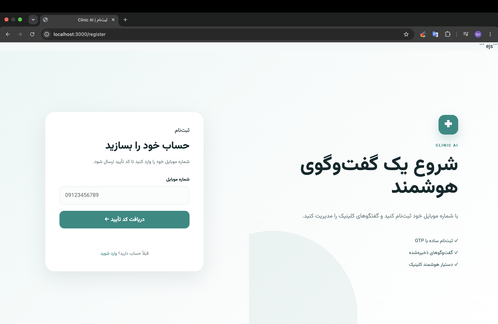
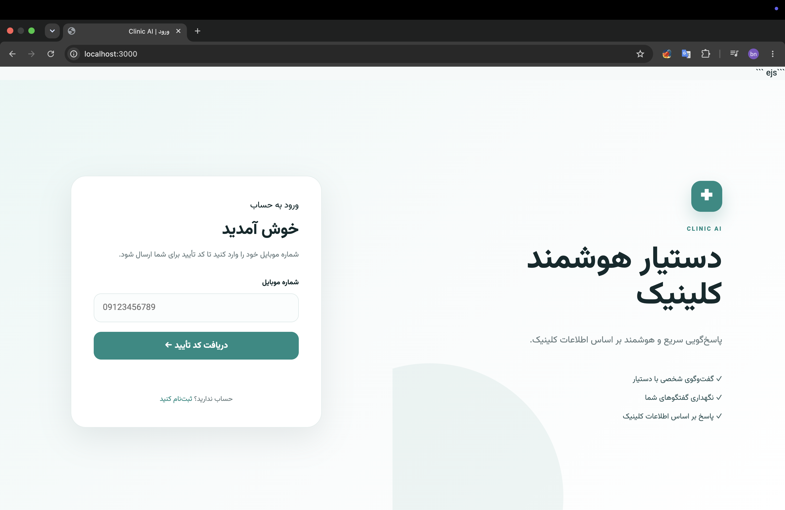
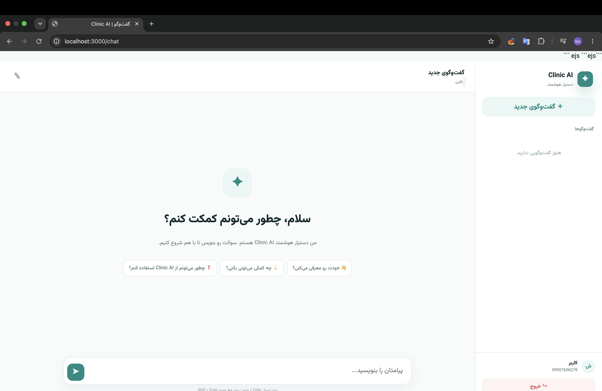

# 🩺 Clinic AI — RAG Chatbot for Clinics

A Persian (RTL) chatbot that answers patients' questions **using only the clinic's own information** — visiting rules, appointment cancellation, blood-test fasting, MRI preparation and more.

Instead of letting an LLM guess, every question is matched against the clinic's knowledge base using **embeddings + cosine similarity** (Retrieval-Augmented Generation). The model only receives the most relevant documents, and if no relevant information is found, the bot honestly says that it doesn't have enough information.

> ⚠️ **Disclaimer:** This is a personal learning project. The bot provides general clinic information only and is **not a substitute for medical advice**.

---

## ✨ Features

* **Grounded answers (RAG)** — answers are generated from retrieved clinic documents rather than the model's general knowledge
* **Similarity threshold** — if no document is relevant enough, the bot responds without calling the LLM
* **Follow-up question handling** — short questions such as *"how many hours?"* are searched together with the previous user message
* **OTP authentication** — login and registration using a phone number and SMS verification code
* **Redis OTP storage** — OTP codes are stored in Redis with a 2-minute expiration
* **JWT authentication** — access and refresh tokens stored in signed, `httpOnly` cookies
* **Multiple conversations** — users can create, rename and delete conversations
* **Conversation history** — messages are persisted and previous messages can be used as context
* **Persian RTL interface** — responsive chat interface built with EJS and vanilla JavaScript
* **Knowledge-base based answers** — the AI is restricted to information retrieved from the clinic knowledge base

---

## 🧠 How It Works

The project uses a simple **Retrieval-Augmented Generation (RAG)** pipeline.

```text
User Question
      │
      ▼
Create Question Embedding
      │
      ▼
Compare With Clinic Documents
      │
      ▼
Cosine Similarity
      │
      ▼
Is Similarity Above Threshold?
      │
   ┌──┴───┐
   │      │
  No     Yes
   │      │
   ▼      ▼
No Info   Select Top Documents
Response       │
               ▼
        Send Context to LLM
               │
               ▼
        Generate Persian Answer
               │
               ▼
          Save Message
```

### RAG Pipeline

1. The clinic's knowledge is divided into small, single-topic documents.
2. Each document is converted into an embedding and stored in MySQL.
3. When a user sends a message, the question is converted into an embedding.
4. The question embedding is compared with the stored document embeddings using cosine similarity.
5. If the best similarity score is below the configured threshold, the bot does not call the LLM.
6. If relevant information is found, the most relevant documents are selected.
7. The selected documents are provided to the LLM as context.
8. The LLM generates a short Persian answer based only on the provided information.
9. The user's message and the bot's response are saved in the conversation.

---

## 🛠 Tech Stack

| Layer             | Technology                   |
| ----------------- | ---------------------------- |
| Runtime / Server  | Node.js, Express 5           |
| Database          | MySQL                        |
| ORM               | Sequelize                    |
| Cache / OTP Store | Redis, ioredis               |
| Authentication    | JWT, Passport                |
| Validation        | Yup                          |
| AI                | OpenRouter API               |
| Embeddings        | OpenRouter API               |
| Frontend          | EJS, Vanilla JavaScript, CSS |
| Architecture      | REST API + RAG               |

---

## 📁 Project Structure

```text
.
├── app.js
├── server.js
├── relation.js
├── config.app.js
├── seed.js
├── package.json
├── README.md
│
├── docs/
│   ├── login.png
│   ├── register.png
│   └── chat.png
│
└── src/
    ├── config/
    │   ├── db.js
    │   └── config.json
    │
    ├── migrations/
    │   ├── users
    │   ├── conversations
    │   ├── messages
    │   └── clinic_documents
    │
    ├── clinic.txt
    │
    ├── models/
    │
    ├── module/
    │   ├── auth/
    │   ├── conversations/
    │   └── messages/
    │
    ├── service/
    │   ├── ai.services.js
    │   ├── embedding.services.js
    │   └── sendOtpCode.js
    │
    ├── utils/
    │   ├── searchVecto.js
    │   ├── compareEmnedding.js
    │   ├── saveChunk.js
    │   └── ...
    │
    ├── views/
    │   ├── login
    │   ├── register
    │   └── chat
    │
    └── public/
        ├── css/
        └── js/
```

---

## 🚀 Getting Started

### Prerequisites

Before running the project, make sure you have:

* Node.js 18+
* MySQL
* Redis
* OpenRouter API key
* SMS provider account for OTP authentication

---

### 1. Clone the Repository

```bash
git clone https://github.com/benyamin-haghighy/clinic-chatbot.git
cd clinic-chatbot
```

Install dependencies:

```bash
npm install
```

---

### 2. Configure Environment Variables

Create your `.env` file:

```bash
cp .env.example .env
```

Then configure the required variables:

| Variable                 | Description              |
| ------------------------ | ------------------------ |
| `PORT`                   | Server port              |
| `ACCESSTOKEN_SECRET`     | Access token secret      |
| `ACCESSTOKEN_EXPIRESIN`  | Access token expiration  |
| `REFRESHTOKEN_SECRET`    | Refresh token secret     |
| `REFRESHTOKEN_EXPIRESIN` | Refresh token expiration |
| `COOKIE_PARSER`          | Cookie signing secret    |
| `REDIS_URI`              | Redis connection string  |
| `SMS_API_KEY`            | SMS provider API key     |
| `SMS_PATTERN_CODE`       | OTP SMS pattern          |
| `OPENROUTER_API_KEY`     | OpenRouter API key       |

For generating a secure secret:

```bash
node -e "console.log(require('crypto').randomBytes(48).toString('hex'))"
```

Use a different random value for each secret.

---

## 🗄 Database Setup

Configure your MySQL credentials in the project's database configuration.

Then run:

```bash
npm run db:create
npm run db:migrate
```

If the database already exists, you can skip `db:create`.

---

## 🧠 Add Clinic Knowledge

The chatbot uses `src/clinic.txt` as its knowledge base.

Each document should start with a `## Title` heading.

Example:

```text
## Blood test preparation

For a fasting blood sugar test, the patient must fast for at least 8 hours.
Plain water is allowed.

## Cancelling an appointment

Appointment cancellation must be done at least 2 hours before the appointment.
```

Each topic should preferably be stored as a separate document.

After editing the knowledge base, run:

```bash
npm run seed
```

The seed process:

1. Reads `src/clinic.txt`
2. Splits the content into documents
3. Creates embeddings
4. Stores the documents and embeddings in MySQL

If you update the clinic knowledge later, run the seed command again.

---

## ▶️ Run the Project

Start the application:

```bash
npm start
```

For development:

```bash
npm run dev
```

Then open:

```text
http://localhost:<PORT>
```

---

## 📜 Available Scripts

| Command                       | Description                                   |
| ----------------------------- | --------------------------------------------- |
| `npm start`                   | Start the server                              |
| `npm run dev`                 | Start the server with automatic restart       |
| `npm run db:create`           | Create the MySQL database                     |
| `npm run db:migrate`          | Run database migrations                       |
| `npm run db:migrate:undo`     | Undo the last migration                       |
| `npm run db:migrate:undo:all` | Undo all migrations                           |
| `npm run db:reset`            | Reset the database                            |
| `npm run db:drop`             | Drop the database                             |
| `npm run seed`                | Generate and store clinic document embeddings |

> ⚠️ Commands such as `db:reset`, `db:migrate:undo:all` and `db:drop` can delete database data.

---

## 🔌 API Overview

### Authentication

| Method | Endpoint         | Description                             |
| ------ | ---------------- | --------------------------------------- |
| `POST` | `/auth/register` | Register using phone number and OTP     |
| `POST` | `/auth/login`    | Verify OTP and authenticate user        |
| `POST` | `/auth/logout`   | Logout and clear authentication cookies |
| `GET`  | `/auth/me`       | Get current authenticated user          |

### Conversations

| Method   | Endpoint            | Description              |
| -------- | ------------------- | ------------------------ |
| `GET`    | `/conversation/`    | Get user's conversations |
| `POST`   | `/conversation/`    | Create a conversation    |
| `GET`    | `/conversation/:id` | Get a conversation       |
| `PUT`    | `/conversation/:id` | Rename a conversation    |
| `DELETE` | `/conversation/:id` | Delete a conversation    |

### Messages

| Method | Endpoint                    | Description                                |
| ------ | --------------------------- | ------------------------------------------ |
| `GET`  | `/message/conversation/:id` | Get conversation messages                  |
| `POST` | `/message/conversation/:id` | Send a message and receive the AI response |

Authentication-protected endpoints require a valid access-token cookie.

---

## ⚙️ RAG Configuration

Several parameters can be adjusted to control the chatbot's behavior.

| Setting                       | Location                |
| ----------------------------- | ----------------------- |
| Similarity threshold          | `message.controller.js` |
| Number of retrieved documents | `message.controller.js` |
| Previous message context      | `message.controller.js` |
| Chat model                    | `ai.services.js`        |
| System prompt                 | `ai.services.js`        |
| Embedding model               | `embedding.services.js` |

### Similarity Threshold

The similarity threshold determines whether the chatbot has enough relevant information to answer.

For example:

```text
Similarity >= 0.5
        ↓
Relevant information found
        ↓
Send context to LLM
```

```text
Similarity < 0.5
        ↓
Not enough relevant information
        ↓
Do not call LLM
```

The exact threshold should be tested against the project's own questions and knowledge base.

---

## 📸 Screenshots

### 🔐 Register

The registration page allows users to start the OTP authentication process using their phone number.



---

### 🔑 Login

Users can authenticate using the OTP verification process.



---

### 💬 Chat

The main chat interface allows users to create conversations and ask questions about the clinic.



---

## 🔒 Security

* `.env` is excluded from Git using `.gitignore`
* Authentication tokens are stored in signed `httpOnly` cookies
* OTP codes are stored temporarily in Redis
* Conversation access is checked against the authenticated user's ID
* Users can only access their own conversations and messages
* Clinic knowledge is separated from user-generated messages
* The project should not be used with real patient data without an appropriate security and privacy review

---

## ⚠️ Known Limitations

* Similarity search currently runs in Node.js against the stored documents.
* This approach is suitable for a relatively small knowledge base.
* A vector database can be introduced for larger datasets.
* Free AI providers may have rate limits.
* Responses are currently not streamed token by token.
* There is currently no admin panel for managing clinic documents.
* The chatbot is not intended to provide medical diagnosis or treatment.

---

## 🗺 Roadmap

* [ ] Admin panel for managing clinic documents
* [ ] Import knowledge from PDF and text files
* [ ] Streaming AI responses
* [ ] Automated RAG evaluation tests
* [ ] Rate limiting
* [ ] Automated tests
* [ ] Vector database integration
* [ ] Docker Compose setup
* [ ] Voice-based clinic assistant

---

## 📄 License

This project is licensed under the MIT License.
